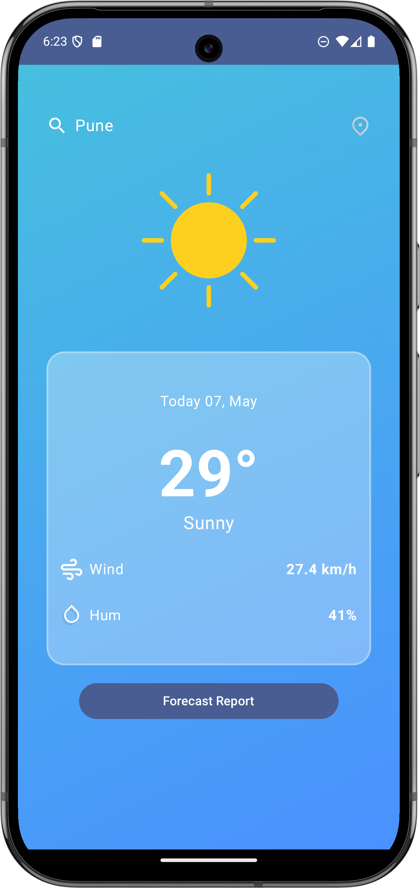

# Weather App

This is a simple weather application that provides current weather information and a forecast for a given location.

## Features

*   Display current temperature and weather conditions.
*   Provide a multi-day weather forecast.
*   Search for weather information by city or location.
*   (Add more features as your app develops)

## Project Showcase

[//]: # 

*   **Screenshot 1:** The main screen showing the current weather for a searched location.

[//]: # 

*   **Screenshot 2:** The forecast screen displaying upcoming weather conditions.

[//]: # (Insert Screenshot 3: Search Screen here)

*   **Screenshot 3:** The search screen where users can enter a location.

## Technical Details

### Architecture

The application follows a Model-View-ViewModel (MVVM) architectural pattern.

*   **Model:** Represents the data layer, including data sources (APIs, local database) and data models (e.g., `WeatherResponse`, `GeocodingResponse`).
*   **View:** The UI layer built with Jetpack Compose. It observes changes in the ViewModel and updates the UI accordingly.
*   **ViewModel:** Holds the UI state, interacts with the data repository to fetch data, and exposes data and actions to the View.

### Data Flow

1.  The **View** triggers events (e.g., a button click to search for a location).
2.  These events are handled by the **ViewModel**.
3.  The **ViewModel** interacts with the **Repository** to fetch data.
4.  The **Repository** retrieves data from the **Data Sources** (e.g., making API calls).
5.  The data is returned to the **Repository**, then to the **ViewModel**.
6.  The **ViewModel** updates its state (e.g., `WeatherData` or `ForecastData`).
7.  The **View**, observing the ViewModel's state, updates the UI.

### Key Dependencies

*   **Jetpack Compose:** Modern Android UI toolkit.
*   **Retrofit:** For making network requests to weather APIs.
*   **Moshi:** A JSON parsing library for Kotlin.
*   **Hilt (Dagger-Hilt):** Dependency Injection framework.
*   **Room:** For local data persistence (e.g., storing recent searches).
*   **Coil:** An image loading library for Android.
*   **Coroutines and Flow:** For asynchronous operations and reactive programming.